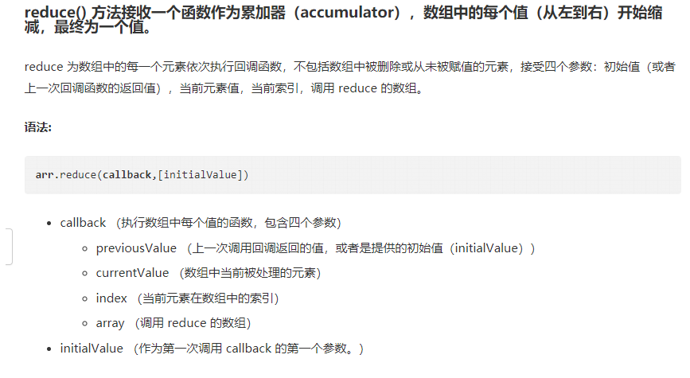

# 数组常用api

----
### 目录
**1. [数组.filter()](#jump1) 创建一个新的数组，检查指定数组中符合条件的所有元素(项)组成一个新数组。**  
**2. [数组.find()](#jump2) 返回符合回调函数的第一个元素的值。**   
**3. [数组.reduce()](#jump3) 方法接收一个函数作为累加器（accumulator），数组中的每个值（从左到右）开始缩减，最终为一个值。**

### <span id="jump1">1.数组.filter()</span>
:sparkles: 例子1
``` js
    newArr = arr.filter(symbol => symbol.ori_name.includes('abc'))
```
:sparkles: 例子2
``` js
    newArr = arr.filter(age => age>18)
```

### <span id="jump2">2.数组.find()</span>


### <span id="jump3">3.数组.reduce()</span>

<br/>
:sparkles: 例子1
``` js
    resultPriceObj = ["BTC","ETH","USDT","LTC","USD_KOINAL"].reduce((memo,next,current) => (memo[next] = 0,memo),{})
    <!-- {BTC: 0, ETH: 0, USDT: 0, LTC: 0, USD_KOINAL: 0} -->
```