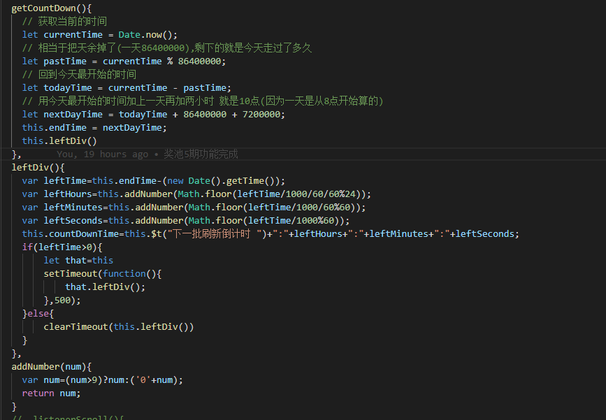

## 目录
**1. [后退页面时回到滚动记录的位置](#jump1)**  
**2. [前端倒计时功能](#jump2)**  
**3. [文字滚动效果](#jump3)**  

### <span id="jump1">1.后退页面时回到滚动记录的位置</span>

:tropical_drink: 需求分析  
    用户在滚动到页面1某个位置时候点击了跳转 ,跳转后点击回退后回退到页面1时,默认会回到页面顶部,而我们想回到用户之前滚动的位置

:sparkles: 解决方案1 (页面缓存 返回时不会刷新页面了)
``` js {12}
//路由中:
    
const router = new VueRouter({
  mode: 'history',
  [
      {
        path: '/',
        name: 'home',
        component: home,
        meta: {
          title: 'home',
          keepAlive: true
        }
      }
  ],
  scrollBehavior (to, from, savedPosition) {
    if (savedPosition) {
      return savedPosition
    } else {
      if (from.meta.keepAlive) {
        from.meta.savedPosition = document.body.scrollTop
      }
      return { x: 0, y: to.meta.savedPosition || 0 }
    }
  }
})
```

``` js
//:在组件中 例如在全局即在app.vue中改写

<keep-alive >
   <router-view v-if="$route.meta.keepAlive"></router-view>
</keep-alive>
<router-view v-if="!$route.meta.keepAlive"></router-view>
```

:sparkles: 解决方案2 (页面不缓存 返回时会刷新页面调取接口)

``` js
//:在需要的组件中 
mounted(){
  //页面获取数据结束,图片加载完成 不一定写这里
  this.$refs.scroll.scrollTo(0,this.$store.state.CURRENTSCROLL.height,500)
},
beforeRouteLeave (to, from, next) {
  if (from.meta.scrollFlag) {
    let scrollTop = this.$refs.scroll.scroll.y
    this.$store.commit('SET_CURRENT_SCROLL', scrollTop)
  } else {
    this.$store.commit('SET_CURRENT_SCROLL', 0)
  }
  next()
},
```

``` js
//路由中:
const router = new VueRouter({
  mode: 'history',
  [
      {
        path: '/',
        name: 'home',
        component: home,
        meta: {
          title: 'home',
          scrollFlag: true
        }
      }
  ]
})
```

``` js
//mutations加入 :
[types.SET_CURRENT_SCROLL](state,disdance){
  state.CURRENTSCROLL.height = disdance
}
```

``` js
//mutation-types :
export const SET_CURRENT_SCROLL = "SET_CURRENT_SCROLL"
```

``` js
//state:
CURRENTSCROLL: {
  height: '' //滚动的距离
}
```


### <span id="jump2">2.前端倒计时功能</span>

:tropical_drink: 需求分析  
  前端倒计时功能

:sparkles: 解决方案   


### <span id="jump3">3.文字滚动效果</span>

:tropical_drink: 需求分析  
  前端文字滚动效果 使用marquee html标签即可

:sparkles: 解决方案   
``` js {12}
//路由中:
    
<div class="notice-right">
  <marquee direction="left" style="line-height:40px;">
    <template v-for="(item,index) in lotteryFeed">
      
      <span :key="index+'lotteryFeed1'" @click="lotteryFeedClick(item)">{{ item.title }}</span>
      &nbsp;&nbsp;&nbsp;&nbsp;&nbsp;&nbsp;&nbsp;&nbsp;&nbsp;&nbsp;&nbsp;&nbsp;
    </template>
  </marquee>
</div>
```